Scrum 被广泛应用于软件、硬件、嵌入式、网络交互、自动驾驶、教育与政府管理等复杂领域，强调小团队的高适应性与快速响应。
我所在团队在复杂多变的技术与业务环境下，引入 Scrum 的迭代与增量方式，目标是快速交付可用版本并持续演进。

项目目标：
在 Smart-Admin 框架内，集成并开发 Scrum 相关模块（如产品、迭代、待办、燃尽、评审、回顾等），形成可操作的管理后台，支撑团队日常研发活动。

成果与价值:
完成 Scrum 模块的端到端打通（角色/权限、菜单路由、表单与列表、基础统计视图）。
交付可用版本并支持小范围试运行；缺陷率与回归率逐迭代下降，联调效率提升。
形成“环境配置模板 + 脚本化修复 + 启动巡检”的运维工作流，降低新人接入成本。
沉淀团队规范：接口命名、事务边界、错误码与日志规范、构建与发布清单。

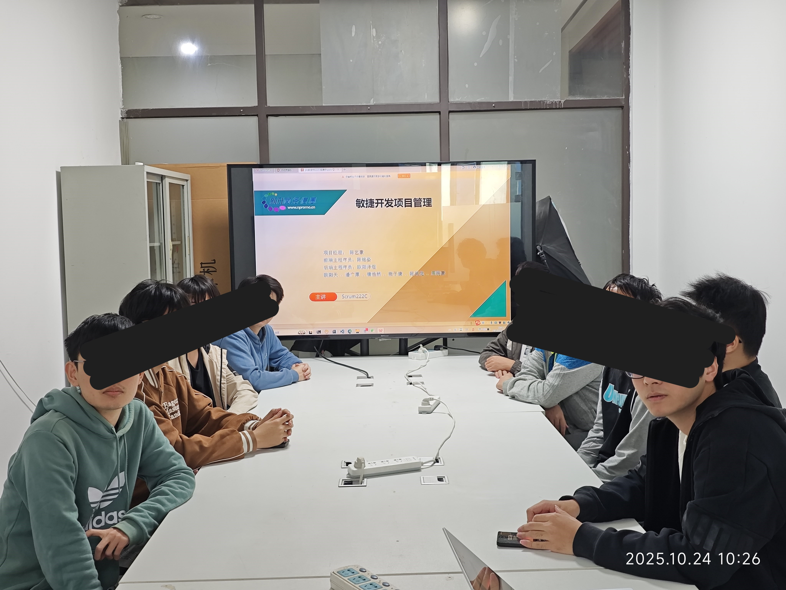

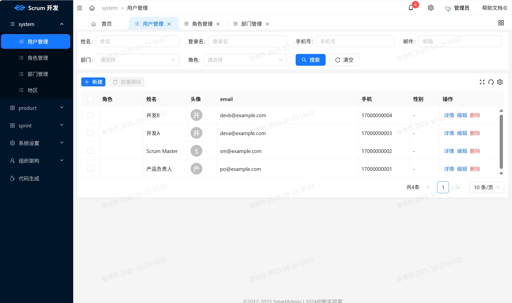
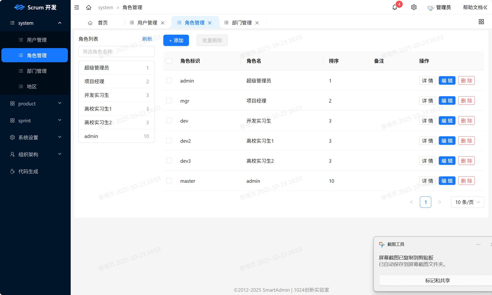
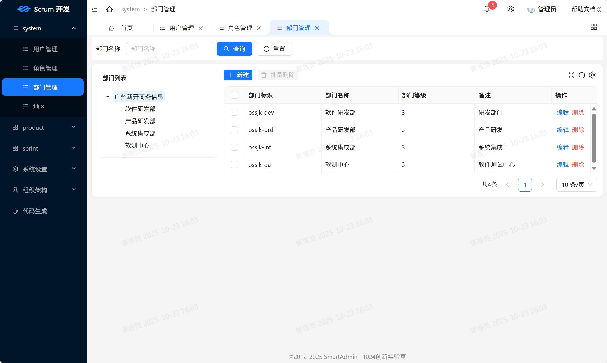
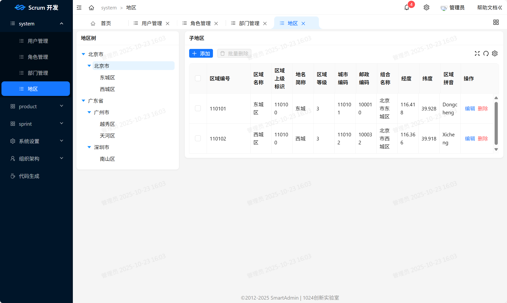
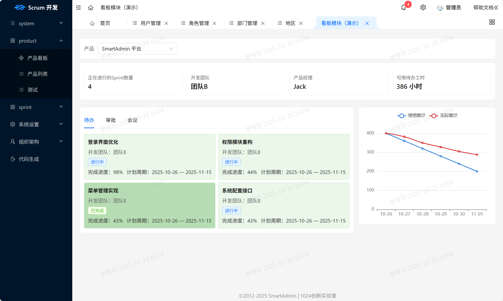
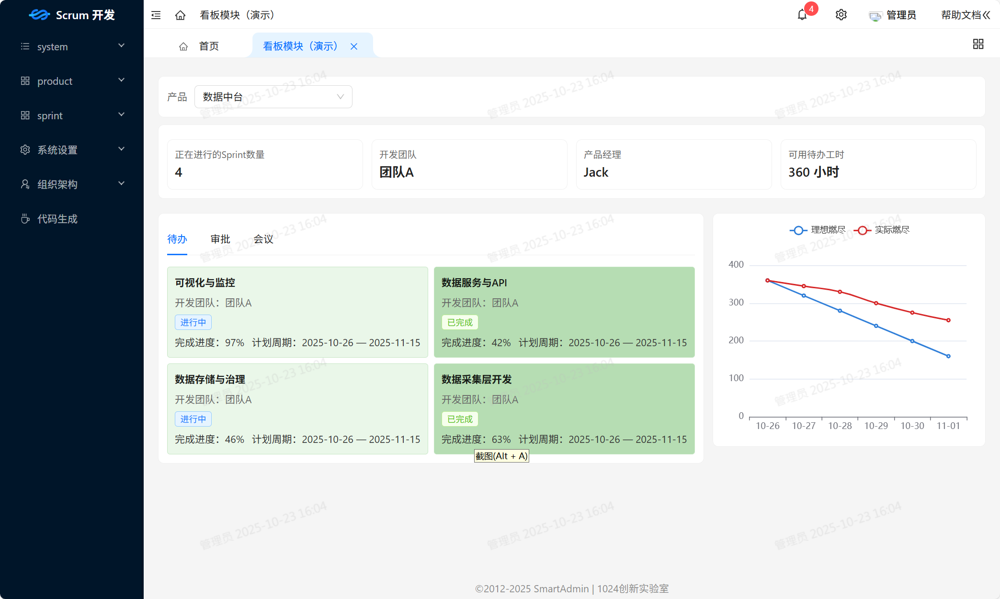
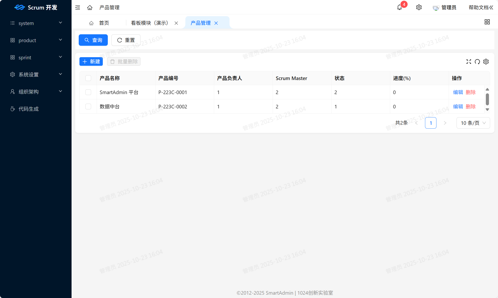
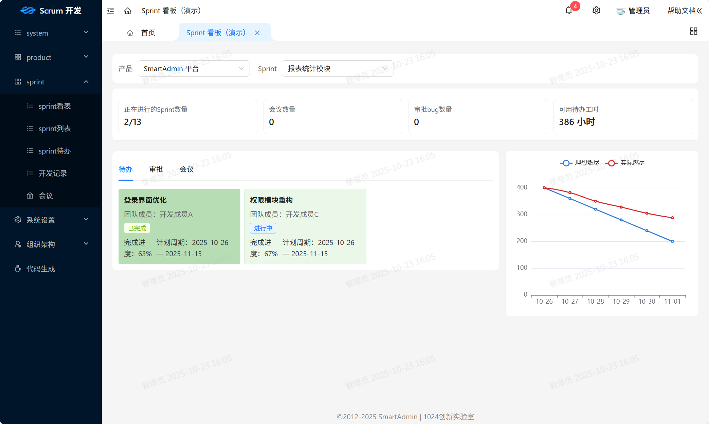
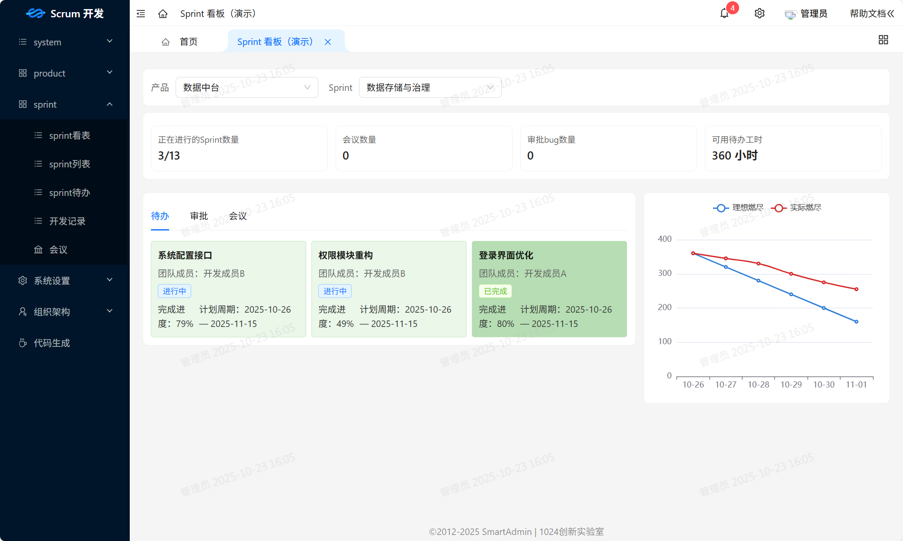
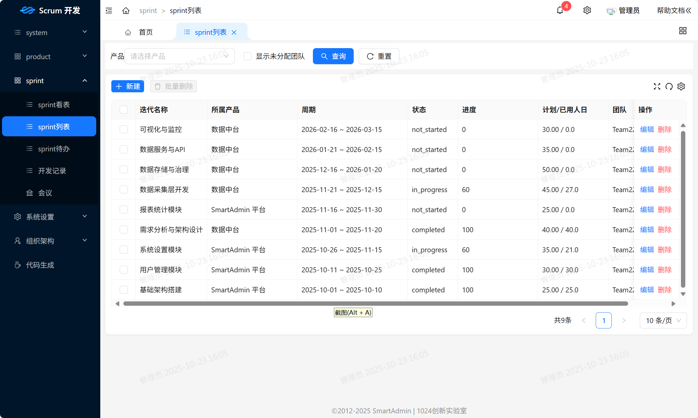
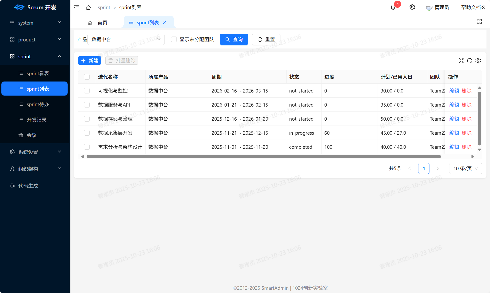
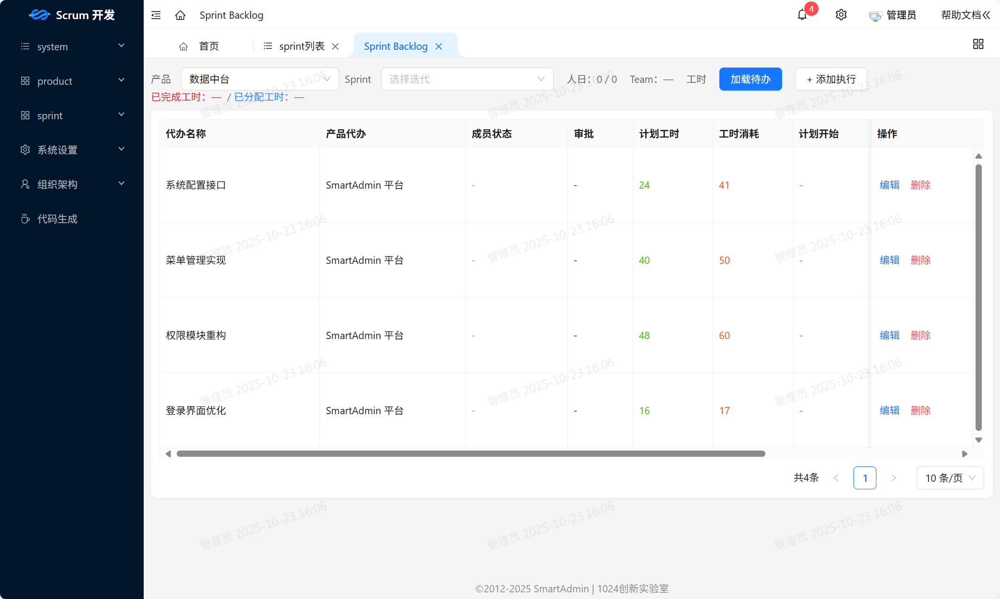
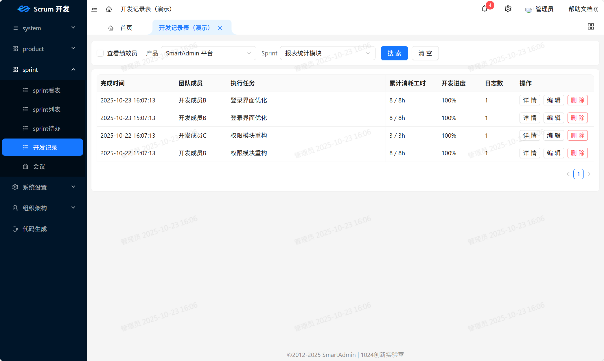
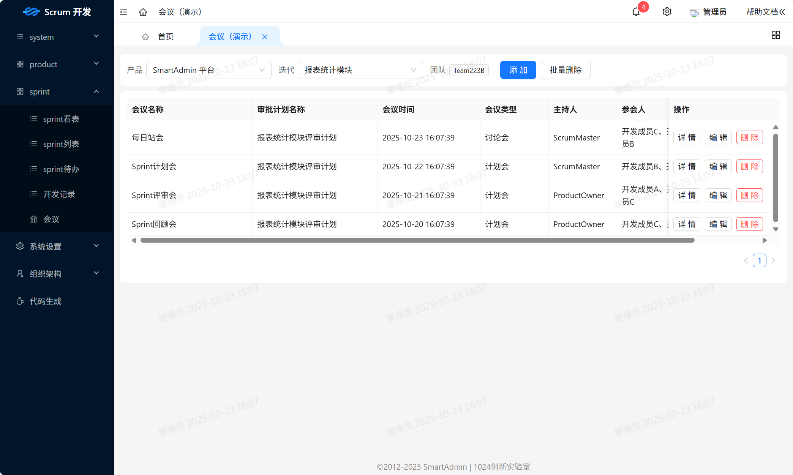
